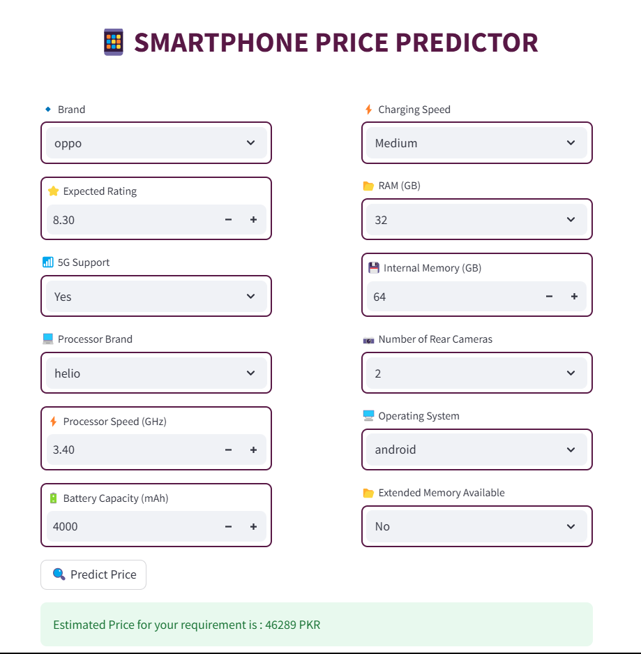

# Smartphone-Price-Predictor

## **Objective**
Finding a smartphone within budget can be tricky with so many options. This project simplifies the process by predicting smartphone prices based on user preferences like **RAM, Brand, Battery, Camera, and more**. Users can enter their requirements through an interactive interface and get an instant price prediction using a machine learning model.

### **Model Performance**  
The trained model achieves an R² score of **0.89 (89%)**, indicating strong predictive performance in estimating smartphone prices based on user preferences.

## **Screenshots**  
Here’s a preview of the interactive interface:  

### Tools & Techniques Used

* Programming Language: Python
* Libraries: Pandas, NumPy, Scikit-learn, Matplotlib, Seaborn
* Machine Learning Algorithm: Random Forest
* Feature Engineering: Data Cleaning, Encoding Categorical Variables, Scaling
* Model Evaluation: Mean Absolute Error (MAE), R-squared Score
* Interface: Streamlit (for user interaction)

Project Overview
The project follows these key steps:
✅ Data Collection & Preprocessing – Cleaning and structuring raw data for model training
✅ Feature Engineering – Transforming and selecting relevant features
✅ Model Training & Evaluation – Training multiple ML models and evaluating performance
✅ Interactive UI Development – Using Streamlit for a user-friendly interface